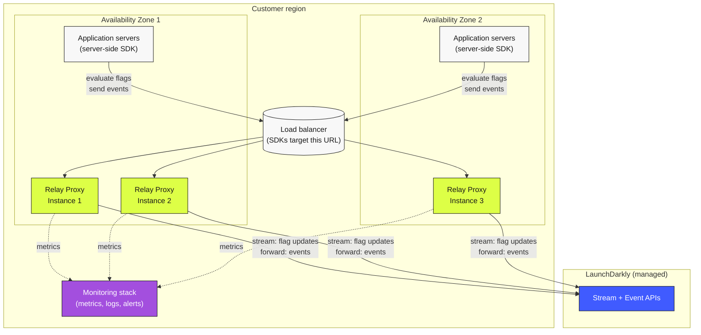

# Server SDK + Relay Proxy Topology

The canonical production deployment for server-side LaunchDarkly use. Server applications connect to a high-availability Relay Proxy fleet (three instances across two availability zones, fronted by a load balancer, per the [Relay Proxy guidelines](https://launchdarkly.com/docs/sdk/relay-proxy/guidelines)). The Relay fleet maintains a streaming connection to LaunchDarkly and serves flag evaluations and events to the SDKs.

## Architecture

## Properties

- **High availability.** Three instances across two AZs ensure one-instance and one-AZ failures don't take down flag evaluation.
- **Centralized egress.** Application servers don't need direct outbound to LaunchDarkly; only the Relay fleet does. Useful for restricted-egress environments.
- **Reduced connection count.** Many SDK instances share a small number of Relay-to-LaunchDarkly streaming connections.
- **In-region latency.** SDK-to-Relay round-trips stay within the region.
- **Observability.** Relay metrics (connection count, latency, error rate, saturation) feed the same monitoring stack as the rest of the platform.

## When to use this pattern

- The default for production server-side deployments at non-trivial scale.
- Required when application hosts can't reach LaunchDarkly directly (restricted egress, air-gapped, regulated networks).
- Useful when SDK instance count is high enough that reducing total connections to LaunchDarkly meaningfully helps.

## When *not* to use this pattern

- Serverless / very short-lived workloads — see [Diagram 03 (multi-region + daemon mode)](./03-multi-region-daemon-serverless.md).
- Edge runtimes — see [Diagram 04 (edge evaluation)](./04-edge-evaluation.md).
- Browser / mobile clients — see [Diagram 02 (client + bootstrap)](./02-mobile-client-bootstrap.md).
- Very small deployments where the Relay's operational overhead isn't worth it.

## Cloud-specific notes

- **AWS:** load balancer is typically an ALB or NLB; the Relay fleet runs on EKS, ECS, or EC2 Auto Scaling Groups. The two AZs map directly to AWS AZs in the region.
- **GCP:** load balancer is an HTTPS Load Balancer or Internal Load Balancer; the fleet runs on GKE, Cloud Run, or managed instance groups. AZs map to GCP zones in a region.
- **Azure:** load balancer is an Application Gateway or Load Balancer; the fleet runs on AKS, App Service, or VM Scale Sets. AZs map to Azure availability zones.
- **On-prem / hybrid:** load balancer is NGINX, HAProxy, F5, or a service-mesh gateway; the fleet runs on Kubernetes, VMs, or bare metal. "AZs" map to whatever failure domains the data center provides.

## Related

- [Reliability pillar — Relay Proxy deployment](../../pillars/reliability/best-practices.md) (BP-4.x)
- [Operational Excellence — Capacity planning](../../pillars/operational-excellence/best-practices.md) (BP-7.x)
- [Lab 06 — Relay Proxy Deployment](../../labs/06-relay-proxy-deployment.md)
- [Relay Proxy guidelines](https://launchdarkly.com/docs/sdk/relay-proxy/guidelines)
