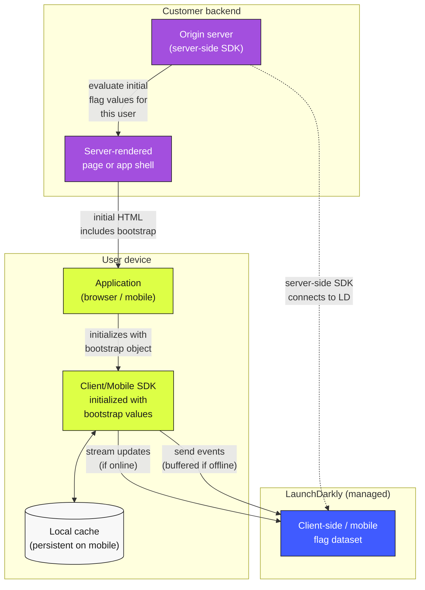

# Mobile + Client-Side + Bootstrap Pattern

How mobile applications and browser-based applications get flag values fast, work offline, and avoid the "flash of old behavior" on first render. The pattern combines server-side rendering of initial flag values (bootstrap), persistent local caching, and graceful offline behavior.

## Architecture

## Properties

- **No first-paint flash.** The client SDK initializes with the bootstrap values rendered by the server. Users never see the "old default" while the client waits to fetch flags.
- **Works offline.** The persistent local cache holds the most recent flag dataset. A mobile app launched in airplane mode evaluates from cache.
- **Streams when online.** Once the client SDK can reach LaunchDarkly, it streams updates so flag changes appear without a refresh.
- **Buffers events offline.** Custom events emitted offline are queued and flushed when the network returns.
- **Uses public credentials.** The client/mobile SDK uses a client-side ID or mobile key (not a secret SDK key), so credential exposure on the client is acceptable.

## How bootstrap works

1. **Server-side request.** When the user requests the page or launches the app, the origin server uses its **server-side SDK** to evaluate all relevant flags for that user's context.
2. **Inject into response.** The evaluated flag values are serialized into the HTML response (for web) or the initial app payload (for mobile).
3. **Client initializes.** The client SDK is initialized with the bootstrap object. It returns those values immediately for the first set of evaluations.
4. **Stream catches up.** In the background, the SDK opens a streaming connection to LaunchDarkly and keeps the dataset current.

## When to use this pattern

- Any browser-based application where first-paint matters.
- Any native mobile application — iOS, Android, cross-platform — where offline-first behavior is required.
- Single-page applications (SPAs) where the initial render needs to respect targeting decisions.
- Any client where you'd otherwise see a flash of incorrect behavior while waiting for the SDK to fetch.

## Mobile-specific considerations

- **App-store cadence.** A mobile app's release cadence is determined by app stores (review delays, user update behavior), not deploys. Flags decouple feature release from app release.
- **Long-running client sessions.** Mobile apps stay open across network transitions. The SDK must handle reconnection gracefully.
- **Background mode.** Flag changes during background may or may not reach the client until the next foreground; design assumes some staleness.
- **Persistent cache survival.** The cache survives app restarts; tests should validate that cached values are used at cold-start before the network is reached.

## When *not* to use this pattern

- Pure server-side workloads — use [Diagram 01](./01-server-sdk-relay-topology.md) instead.
- Edge runtimes — use [Diagram 04](./04-edge-evaluation.md) instead.

## Cloud-specific notes

This pattern is largely cloud-agnostic on the backend side. The origin server can be any web framework on any infrastructure. What matters is that the *server-side* SDK and the *client-side* SDK use credentials for the same project/environment, and that the bootstrap payload uses the format the client SDK expects.

## Related

- [Reliability — Initialization, bootstrap, and offline behavior](../../pillars/reliability/best-practices.md) (BP-2.x)
- [Safe Release — Default values and fallback paths](../../pillars/safe-release/best-practices.md) (BP-7.x)
- [Mobile Lens](../../lenses/mobile/) (Phase 3)
- [LaunchDarkly Getting Started — SDK credentials](https://launchdarkly.com/docs/home/getting-started)
