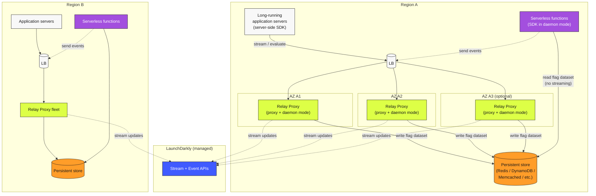

# Multi-Region + Daemon Mode for Serverless

Two stacked patterns. **Multi-region:** regional Relay Proxy fleets serve in-region application traffic. **Daemon mode:** Relay writes the flag dataset to a persistent store, and serverless workloads (Lambda, Cloud Functions, Cloud Run, etc.) read from that store directly — avoiding the streaming-connection cold-start problem.

Either pattern can be deployed independently. They're shown together because most teams deploying daemon mode for serverless are also deploying regionally.

## Architecture

## Properties

### Multi-region

- **In-region latency.** Each region's application traffic stays in that region for flag evaluation.
- **Regional isolation.** A single-region degradation doesn't take down other regions.
- **Independent capacity.** Each region's Relay fleet is sized for its own traffic.
- **Cost trade-off.** More operational surface (more instances, more monitoring) for the latency and isolation benefits.

### Daemon mode

- **Cold-start safe.** Serverless functions don't wait to establish a streaming connection; they read the flag dataset directly from the store on first evaluation.
- **Short-lived workload compatible.** A function that lives for milliseconds gets correct flag values without paying SDK initialization cost.
- **Eventually-consistent.** The store is updated when Relay receives changes from LaunchDarkly; serverless functions see updates with a small propagation lag (typically seconds).

## When to use multi-region

- Application is deployed across regions and serves users globally.
- Latency budget for flag evaluation is tight enough that cross-region round-trips would matter.
- Data residency or regulatory requirements demand in-region processing.
- A regional outage of the LaunchDarkly path must not cascade across regions.

## When to use daemon mode

- The application includes serverless functions (AWS Lambda, Google Cloud Functions, Azure Functions, Cloud Run, etc.).
- Functions are short-lived and frequently cold-started.
- The "streaming SDK can't establish a connection in time" problem is real for the workload.
- The team is willing to operate a persistent store as part of the LaunchDarkly path.

## Persistent store choices

- **Redis** — most common; supported by LaunchDarkly's Relay Proxy out of the box. Can be managed (ElastiCache, Memorystore, Azure Cache) or self-operated.
- **DynamoDB** — AWS-specific; serverless storage that pairs well with Lambda.
- **Memcached / other key-value stores** — supported where LaunchDarkly's Relay has integration.

The choice depends on what the platform team is comfortable operating. Whatever you pick, monitor it like any other production data store.

## Cloud-specific notes

- **AWS:** common stack is Lambda functions (daemon-mode SDK) + DynamoDB or ElastiCache (store) + ECS/EKS-hosted Relay (proxy + writer). Regions map to AWS regions; AZs to AWS AZs.
- **GCP:** Cloud Run / Cloud Functions + Memorystore + GKE-hosted Relay. Regions/zones map directly.
- **Azure:** Azure Functions + Azure Cache for Redis + AKS-hosted Relay. Regions/zones map directly.
- **Multi-cloud:** if you span clouds, the per-region pattern still applies — each region (in each cloud) gets its own Relay + store. The [Hybrid / Multi-Cloud / On-Prem Lens](../../lenses/hybrid-multicloud/) (Phase 3) will cover the trade-offs.

## When *not* to use these patterns

- Single-region deployments don't benefit from multi-region; the cost is operational overhead.
- Long-running server workloads (microservices, monolith servers) don't need daemon mode — see [Diagram 01](./01-server-sdk-relay-topology.md).
- Edge runtimes use [Diagram 04](./04-edge-evaluation.md) instead.

## Related

- [Reliability — Relay Proxy deployment, multi-region, daemon mode](../../pillars/reliability/best-practices.md) (BP-4.x, BP-6.x)
- [Lab 06 — Relay Proxy Deployment](../../labs/06-relay-proxy-deployment.md)
- [LaunchDarkly Relay Proxy use cases](https://launchdarkly.com/docs/sdk/relay-proxy/use-cases)
