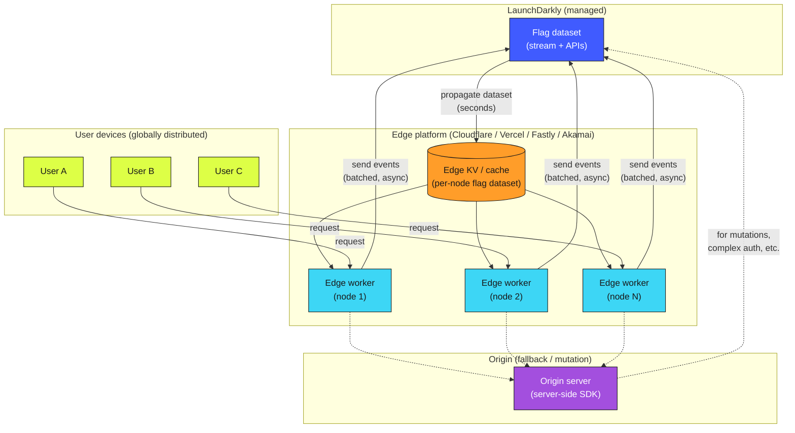

# Edge Evaluation

Flag evaluation at the CDN edge — Cloudflare Workers, Vercel Edge, Fastly Compute, Akamai EdgeWorkers. Sub-millisecond local-latency evaluation, with the flag dataset propagated from LaunchDarkly to every edge node. The trade-off: freshness lag in exchange for speed.

## Architecture

## Properties

- **Sub-millisecond local evaluation.** The flag dataset is in the edge node's memory or local KV; evaluation is essentially a hash lookup.
- **Globally distributed.** Every edge node, across the platform's global footprint, can evaluate flags independently.
- **Propagation lag.** Flag changes at LaunchDarkly take seconds (occasionally longer under degradation) to propagate to every edge node. Edge evaluation is *eventually consistent*, not real-time.
- **Async events.** Edge workers batch and send events asynchronously to LaunchDarkly; they don't block on event submission.
- **Origin fallback.** Complex operations (auth, mutations, queries that need server-side SDKs) flow to the origin; the edge handles the read-heavy, fast-evaluation paths.

## When to use edge evaluation

- **Latency-critical paths** where even sub-100ms is too slow.
- **High-cardinality routing** decisions (A/B testing on landing pages, region-based content selection).
- **Workloads where the edge platform is already in the request path** (Cloudflare Workers fronting an app, Vercel Edge functions in a Next.js app, Fastly Compute@Edge on top of an existing Fastly CDN).
- **Read-mostly flag evaluation** — flags whose values determine *what to serve*, not flags whose values trigger sensitive write paths.

## When *not* to use edge evaluation

- **Real-time kill switches** where the latency budget for "flag change → all users see the change" must be sub-second. Edge propagation isn't fast enough for this. Pair edge with a separate origin-level kill path for these cases.
- **Sensitive write operations** that depend on flag state. Run those through origin with a server-side SDK.
- **Workloads without an existing edge platform** — adopting an edge platform purely for flag evaluation is rarely the right starting point.

## Designing for propagation lag

The fundamental edge-evaluation trade-off is **freshness for speed**. Design with the lag explicitly in mind:

- **Document the expected propagation time** for the edge platform you're using. Cloudflare KV, Vercel Edge Config, Fastly's dictionaries, and Akamai's edge config each have their own propagation characteristics.
- **Don't assume instant propagation for kill switches.** Pair every edge-evaluated kill switch with an origin-level fallback (a CDN purge, an origin-side block) that can act faster if needed.
- **Plan rollouts that tolerate lag.** A guarded rollout's "rollback" instruction takes time to reach every edge node. Don't structure rollouts that assume otherwise.
- **For experiments**, the propagation lag is usually fine — experiments measure averages over windows much longer than propagation time.

## Provider-specific notes

- **Cloudflare Workers** — Cloudflare KV is the typical store; LaunchDarkly provides integration. Cloudflare's KV has eventual consistency across the global network with typical propagation in seconds.
- **Vercel Edge** — Edge Config and KV available. Pair LaunchDarkly with Edge Config for the flag dataset; LD's [edge SDK](https://launchdarkly.com/docs/sdk) handles the integration.
- **Fastly Compute** — Fastly's edge dictionaries are the store; the Fastly + LaunchDarkly integration handles the propagation.
- **Akamai EdgeWorkers** — similar pattern with Akamai's EdgeKV.

## Context propagation

Edge evaluation only works correctly if the context (user identifier, organization, region, etc.) is available at the edge. If your context attributes only exist at origin, edge evaluation against missing context returns the wrong variation. Confirm:

- The user identifier is in the request (cookie, header, JWT, etc.) and parseable at the edge.
- Any other context attributes used in targeting are available without an origin round-trip.

If context requires origin lookups, you've lost most of the edge's latency benefit. Either denormalize context onto the edge or use origin evaluation for that path.

## When *not* to use this pattern

- See "When not to use" above. The summary: edge evaluation is the wrong choice for tight-latency kill paths and for sensitive writes.

## Related

- [Reliability — Edge delivery](../../pillars/reliability/best-practices.md) (BP-5.x)
- [Reliability — Edge propagation as a known property](../../pillars/reliability/anti-patterns.md) (AP-6)
- [Edge & Performance-Critical Lens](../../lenses/edge-performance/) (Phase 3)
- [Performance & Cost Efficiency pillar](../../pillars/performance-and-cost/) (Phase 2)
