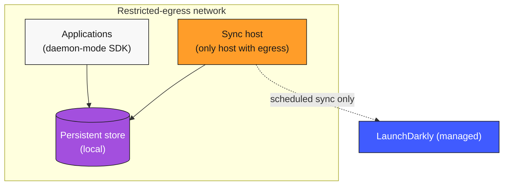

# Air-Gapped & Restricted-Egress Patterns

How to run LaunchDarkly when the SDKs can't reach LaunchDarkly directly. This page covers the spectrum from "outbound goes through a corporate proxy" to "this network has zero internet connectivity, ever."

These patterns are uncommon in absolute terms but vital to the customers they apply to — defense systems, industrial control, secure financial backbones, regulated healthcare workflows, certain government deployments, and any context where outbound internet is a controlled or absent capability.

---

## The egress spectrum

Network environments fall on a spectrum:

| Egress posture | Definition | LD pattern |
|---|---|---|
| **Permissive** | SDKs can connect directly to LaunchDarkly. | Direct connection, possibly via in-region Relay. |
| **Restricted** | All outbound traffic goes through a corporate proxy or controlled egress path. | Relay deployed behind the corporate proxy. |
| **Allowlisted** | Outbound is restricted to a defined set of destinations; LaunchDarkly is on the allowlist. | Relay or direct connection to LaunchDarkly with documented allowlist. |
| **Sync-only** | Outbound is allowed for a periodic, controlled sync only — not for continuous traffic. | Daemon mode with externally-synced store. |
| **Air-gapped** | Zero outbound. The network is physically or logically isolated from the internet. | Daemon mode with manually-promoted store. |

Each posture has a corresponding LD pattern. The wrong pattern for the posture either won't work or will violate the network policy.

---

## Pattern 1 — Restricted egress through a corporate proxy

**Posture.** All outbound traffic must transit a corporate proxy / NAT gateway / SD-WAN appliance. Direct SDK-to-LaunchDarkly connections are not allowed.

**LD pattern.** Relay fleet in the restricted network. Relay's outbound goes through the corporate proxy. Applications connect to Relay locally; Relay's streaming connection to LaunchDarkly transits the proxy.

**Configuration:**

- The Relay Proxy is configured with the corporate proxy as its HTTP/HTTPS proxy (environment variables `HTTPS_PROXY`, `HTTP_PROXY`, or per-Relay config).
- The corporate proxy is configured to permit traffic to LaunchDarkly's endpoints (allowlist).
- TLS terminates at LaunchDarkly, not at the proxy — preserve end-to-end encryption.

**Considerations:**
- Latency: the proxy hop adds tens-of-milliseconds. Acceptable for Relay-to-LD streaming; transparent to in-network applications.
- Reliability: the corporate proxy is a single point of failure. Treat it like one — monitor it, plan for its outages, document fallback behavior.
- Audit: the corporate proxy logs LaunchDarkly traffic. Security teams may use it as a compliance evidence source.

---

## Pattern 2 — Allowlist-only egress

**Posture.** Outbound is restricted to a small set of permitted destinations. LaunchDarkly is on the allowlist; nothing else from the application's egress path can talk to anywhere unexpected.

**LD pattern.** Direct SDK connection or in-network Relay — same as permissive, but with documented egress allowlist entries.

**Required endpoints** (consult [LaunchDarkly's networking docs](https://launchdarkly.com/docs/sdk) for the canonical list; representative entries):
- `stream.launchdarkly.com` (streaming flag updates)
- `events.launchdarkly.com` (event ingestion)
- `clientstream.launchdarkly.com` (client / mobile streaming)
- `clientsdk.launchdarkly.com` (client / mobile config fetching)
- `app.launchdarkly.com` (REST API for management and integrations)

Document the allowlist in the team's network-control inventory. Update when LaunchDarkly publishes endpoint changes (rare; check release notes).

---

## Pattern 3 — Sync-only egress with daemon mode

**Posture.** Outbound is allowed only for a periodic, controlled sync — not for continuous streaming traffic. The network policy might be "outbound is permitted during a 2-hour window once a day, from a defined host, to a defined set of destinations."

**LD pattern.** Daemon mode reading from a local persistent store. The store is populated by a periodic sync process that runs during the permitted window.

**The sync process:**

1. During the permitted egress window, a sync host:
   - Connects to LaunchDarkly's REST API.
   - Fetches the current flag dataset for the relevant projects / environments.
   - Writes the dataset to the local persistent store (Redis, DynamoDB, etcd, or whatever the network supports).
2. SDKs in the restricted network operate in daemon mode, reading the dataset from the local store.
3. The sync is a regular, scheduled process — daily, hourly, or per the team's freshness requirement.

**Properties:**
- The application never makes outbound calls; only the sync host does.
- Flag freshness is bounded by the sync interval.
- Events that the SDK would emit (custom events, evaluations) accumulate locally; the sync also exports them outward.

**Considerations:**
- Flag updates have a latency floor equal to the sync interval. A flip in LaunchDarkly takes (sync interval) + (SDK refresh) to propagate.
- The sync process is itself a release artifact: it's deployed, monitored, audited.
- The local store is a single point of corruption. Validate its integrity after every sync.
- Audit logs from local activity must be sent back during the sync, so the LaunchDarkly audit log is complete.

---

## Pattern 4 — Air-gapped with manual promotion

**Posture.** Zero outbound. The network has no internet connectivity, by physical or logical isolation. Flag updates can only enter via deliberate manual action.

**LD pattern.** Daemon mode reading from a local store. The store is populated by an out-of-band promotion process: someone exports the flag dataset from LaunchDarkly elsewhere, transfers it into the air-gapped network (via approved physical or controlled-link mechanism), and imports it into the local store.

**The promotion process:**

1. On a routine schedule (weekly, monthly, or per change cycle), an authorized operator:
   - Exports the current flag dataset from LaunchDarkly via the REST API on a connected workstation.
   - Reviews the export for content and authorization.
   - Transfers the export into the air-gapped environment via the approved mechanism (signed media, approved cross-domain solution, controlled diode link).
2. Inside the air-gapped environment:
   - The export is imported into the local store.
   - The import is logged in the local audit trail.
   - SDKs continue to read from the local store; new flag values become visible after the next SDK refresh.

**Properties:**
- The air gap is preserved. Nothing connects continuously.
- Flag changes are explicit operational events — not silent.
- The change-management story is *strong*: each promotion is a controlled, reviewed action.

**Considerations:**
- Emergency rollback in an air-gapped environment requires the same manual promotion. The minimum incident response time is the promotion cycle time. Plan accordingly: for highly critical air-gapped systems, an emergency-promotion procedure (operator on-call, accelerated review) is documented.
- The local store needs to be writeable by authorized operators only. Treat it like the system-of-record it is.
- Telemetry / event data flows out the same way it flowed in — collected locally, exported, transferred out via the approved mechanism, imported into LaunchDarkly events. Latency is by definition slow.
- This pattern is intentional friction. The friction is the point. Don't try to remove it; document and own it.

---

## Audit and compliance under restricted egress

For the audit log to be a complete record of all LaunchDarkly activity, events from restricted-egress and air-gapped environments must reach the central audit destination eventually. The pattern:

- Local audit events (within the restricted network) accumulate in a local audit store.
- The sync (Pattern 3) or promotion (Pattern 4) process exports those events back to the central audit destination.
- The team's SIEM ingests both the directly-streamed events and the synced events. Reconciliation confirms the sync didn't drop events.

For regulated workloads, the audit chain is what proves to the auditor that the air-gapped environment hasn't gone rogue. Build the chain deliberately.

---

## Choosing the right pattern

The decision is driven by the network posture, not by preference:

- **Can the SDK reach LaunchDarkly continuously?** Use direct or Relay-with-streaming.
- **Through a proxy?** Pattern 1.
- **Via allowlist only?** Pattern 2 (same as direct/Relay; just document the allowlist).
- **Only on a scheduled window?** Pattern 3 (sync + daemon mode).
- **Never?** Pattern 4 (manual promotion + daemon mode).

The further down this list, the more operational discipline the team needs to invest. The patterns get progressively more friction-heavy because the network is progressively more restrictive — that's the trade.

---

## Common questions

**"Can we make the SDK 'cache forever' and avoid the sync entirely?"**

You can configure the SDK to operate from cache indefinitely, but the dataset becomes stale. Without a sync mechanism, flag changes made in LaunchDarkly never take effect in the restricted environment. This may be acceptable for some workloads (truly static configuration that rarely changes); for most, the sync is the cost of running an air-gapped system that respects the rest of the team's release practice.

**"How fresh does the sync need to be?"**

Match the freshness to the workload's needs:
- **Hourly**: most restricted-egress workloads.
- **Daily**: air-gapped workloads where flag changes are infrequent.
- **On-demand + scheduled**: critical air-gapped workloads with emergency-promotion capability.

Document the freshness as part of the change-management policy.

**"How do we test changes before promoting to air-gapped?"**

The same way as any other release. Test in a non-air-gapped environment first; the air-gapped environment is the production tier, not the development one. The promotion process moves vetted changes; it doesn't validate them.

**"What about emergency kill switches in air-gapped systems?"**

The kill switch flag's value is whatever's in the local store. For emergency kill, the team executes the emergency-promotion procedure (faster than the routine promotion). Some teams maintain a *separate* in-network kill mechanism (a config file, a database row) for ultra-fast emergency disablement; the flag-based kill is the routine mechanism, the in-network mechanism is the panic button. Both have their place.

---

← [Relay Topology Patterns](./relay-topology-patterns.md) | Continue to → [Review Questions](./review-questions.md)
