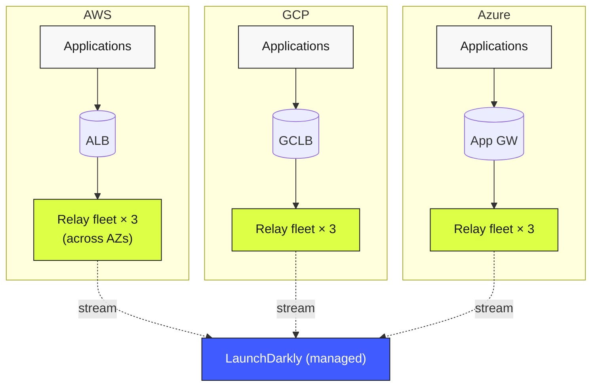
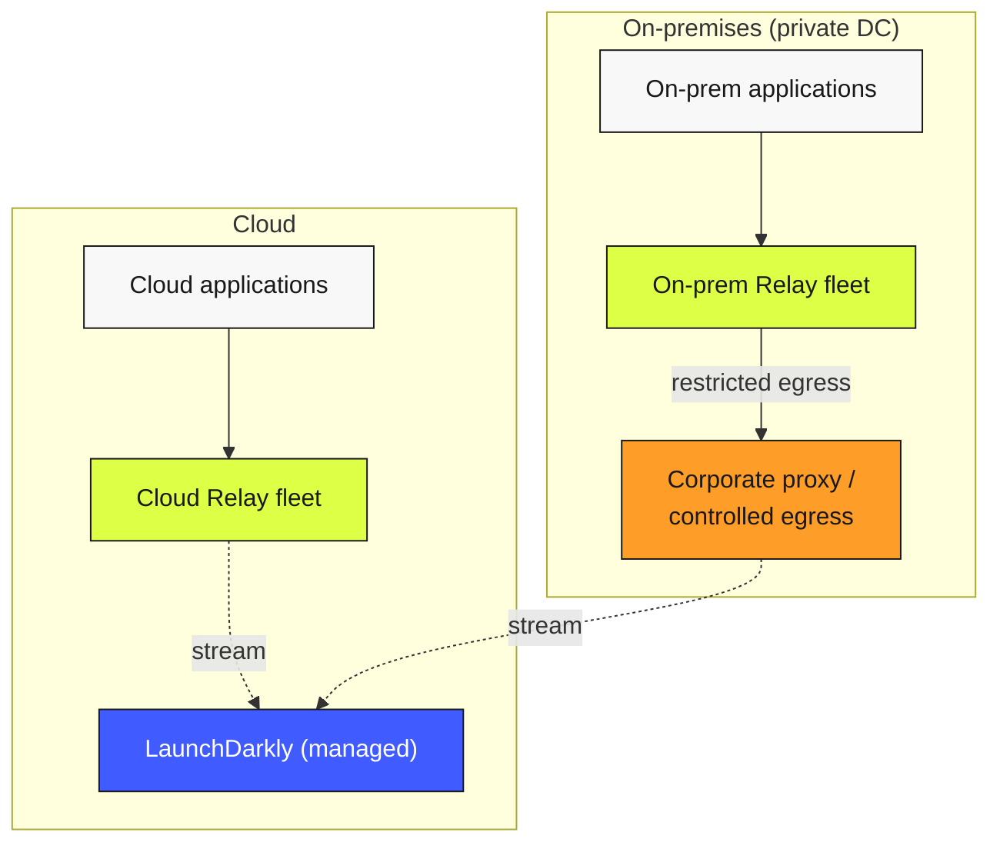
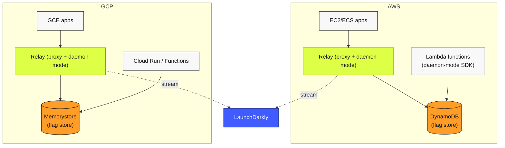

# Relay Topology Patterns

The canonical Relay Proxy deployment patterns for hybrid, multi-cloud, and on-premises environments. The right pattern depends on the network topology, the residency posture, and the team's tolerance for cross-cloud dependencies.

For the base Relay Proxy pattern (single cloud, single region, 3 instances, 2 AZs), see [Reference Diagram 01](../../assets/diagrams/01-server-sdk-relay-topology.md) and [Reliability BP-4.x](../../pillars/reliability/best-practices.md). The patterns here apply that base to multi-network situations.

---

## Pattern 1 — Per-provider Relay fleets (recommended default)

**When to use it.** The workload runs in multiple cloud providers (AWS + GCP, AWS + Azure, etc.) and each provider has applications that need to evaluate flags.

**Shape.**

- Each provider hosts its own Relay fleet — three instances minimum, across two availability zones, fronted by a provider-local load balancer.
- Each fleet maintains its own streaming connection to LaunchDarkly.
- Applications connect to the in-provider Relay fleet only. No cross-cloud calls on the critical path.

**Properties.**
- No inter-cloud dependencies on the critical path.
- Each provider's failure surface is isolated.
- Operational overhead scales linearly with provider count.

**Trade-offs.**
- Higher operational cost: N fleets to monitor, capacity-plan, and maintain.
- Configuration drift risk: keep the fleet config synchronized via IaC.
- N connections to LaunchDarkly instead of one (negligible cost, but worth knowing).

**Cost note.** This pattern eliminates the egress-cost surprise where applications in cloud A unintentionally pay egress fees to reach Relay in cloud B.

---

## Pattern 2 — Hybrid (cloud + on-premises)

**When to use it.** The workload includes both cloud and on-premises components. The on-premises network typically has restricted or controlled egress.

**Shape.**

- The cloud side runs Per-provider Relay fleets (Pattern 1).
- The on-premises network runs its own Relay fleet, sized for local traffic.
- The on-prem Relay either:
  - Has outbound to LaunchDarkly through a controlled egress path (corporate proxy, NAT gateway), and operates in proxy mode like any other fleet, or
  - Has *no* direct outbound and operates in daemon mode reading from a store populated by a sync from outside the network (see [Air-Gapped Patterns](./air-gapped-and-restricted-egress.md) for that variant).

**Properties.**
- On-prem traffic stays on-prem until controlled egress.
- The corporate proxy gives the security team a single audit point for LaunchDarkly traffic.
- Cloud and on-prem are operationally independent.

**Trade-offs.**
- Corporate proxy adds latency and a potential point of failure. Size and monitor it appropriately.
- The team operates two distinct Relay topologies. Document each in its own runbook.

---

## Pattern 3 — Multi-region per provider

**When to use it.** A single provider, multiple regions. (Combinable with Pattern 1: per-region within per-provider.)

**Shape.**

- Each region within the provider has its own Relay fleet.
- Applications connect to the in-region Relay fleet (resolved via DNS or per-region service discovery).
- Cross-region failover is documented and tested but not used in steady state.

This is the standard regional-Relay pattern from [Reference Diagram 03](../../assets/diagrams/03-multi-region-daemon-serverless.md). The hybrid lens just emphasizes the per-region rule: applications never cross regions to reach Relay in normal operation.

---

## Pattern 4 — Hub-and-spoke (anti-pattern; included for completeness)

**Shape.** A single central Relay fleet (in one cloud / region) is reached by applications in all other clouds / regions over inter-cloud network links.

**Why people try it.** Simplest operational model — one fleet to monitor. Lowest license / instance count.

**Why it's an anti-pattern.**
- Cross-cloud latency on every flag evaluation.
- Cross-cloud egress cost on every event.
- Single regional failure takes down flag evaluation for the whole organization.
- Multi-residency posture is impossible — cross-cloud calls violate per-region data handling.

**Use only if.** All of the following: single-cloud-leaning organization, low traffic, strong inter-cloud network, no residency obligations, intentional and documented decision to accept the trade-offs. Even then, watch for the moment it stops being viable.

---

## Pattern 5 — Daemon mode across providers

**When to use it.** A multi-cloud or hybrid workload includes serverless functions (Lambda, Cloud Functions, Cloud Run, Azure Functions) that can't hold streaming SDK connections.

**Shape.**

- A regional Relay fleet (per Pattern 1 or 2) operates in proxy mode for long-lived applications *and* in daemon mode for serverless.
- The daemon mode writes the flag dataset to a persistent store local to the cloud (Redis, DynamoDB, Memorystore, Azure Cache).
- Serverless functions read from the local store via the daemon-mode SDK.

**Properties.**
- Serverless workloads have cold-start safe evaluation.
- Long-lived applications keep their proxy-mode benefits.
- Each cloud has a self-contained LD stack.

**Trade-offs.**
- Each cloud needs its own persistent store. More operational surface.
- Store-write throughput from Relay must keep up with flag-update rate.

---

## Pattern 6 — Federated identity across providers

The Relay topology is one half of the hybrid story; identity is the other. The recommended pattern:

- **Single corporate IdP** (Okta, Entra ID, JumpCloud, Google Workspace) is the canonical source of identity.
- **LaunchDarkly SSO/SAML** is configured against that IdP.
- **SCIM provisioning** populates LaunchDarkly Teams from IdP groups automatically.
- **Same engineer, same identity** across every Relay environment they touch.

The audit log shows the engineer's corporate identity regardless of which Relay they actually hit. Offboarding flows naturally from IdP disablement.

**What not to do:**
- Local LaunchDarkly accounts per provider.
- Provider-specific IdPs without federation.
- Different LaunchDarkly accounts per provider with separate role configurations.

---

## Choosing a pattern

A decision tree:

1. **Is the workload single-cloud, single-region?** → Use the base Relay pattern, not this lens.
2. **Multi-cloud?** → Per-provider Relay fleets (Pattern 1).
3. **Plus serverless?** → Add daemon mode per cloud (Pattern 5).
4. **Plus on-premises?** → Add an on-prem Relay path (Pattern 2). Decide whether on-prem has outbound or is air-gapped (next page).
5. **Plus multi-region within each cloud?** → Add regional sub-fleets (Pattern 3).
6. **In every case** → Federated identity (Pattern 6).

The result is a topology that's larger than a single-cloud team would tolerate but accurately reflects the actual deployment surface.

---

← [Pillar Overlays](./pillar-overlays.md) | Continue to → [Air-Gapped & Restricted-Egress Patterns](./air-gapped-and-restricted-egress.md)
